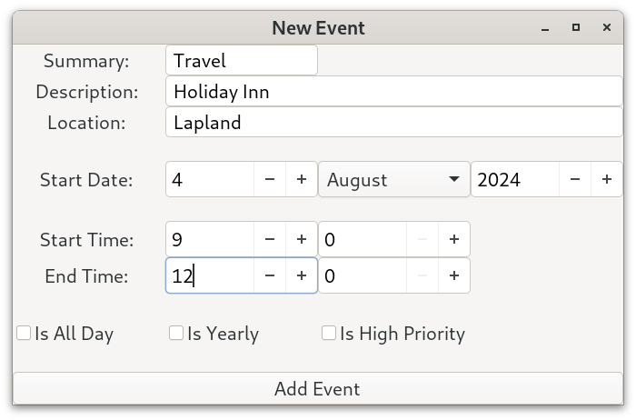
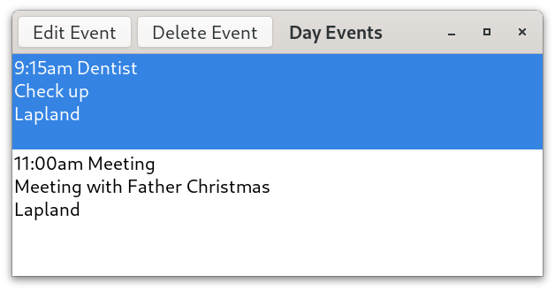
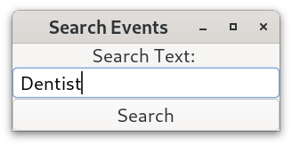
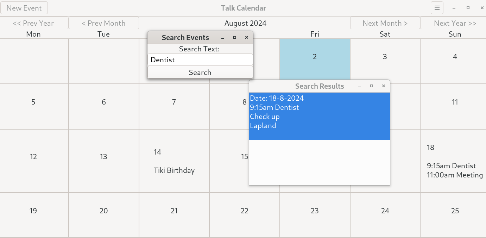
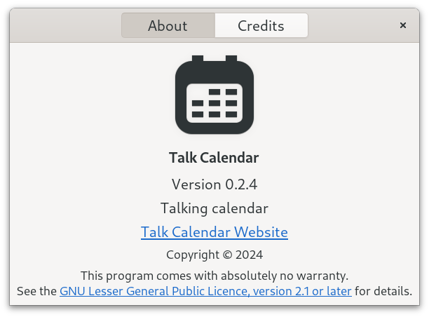
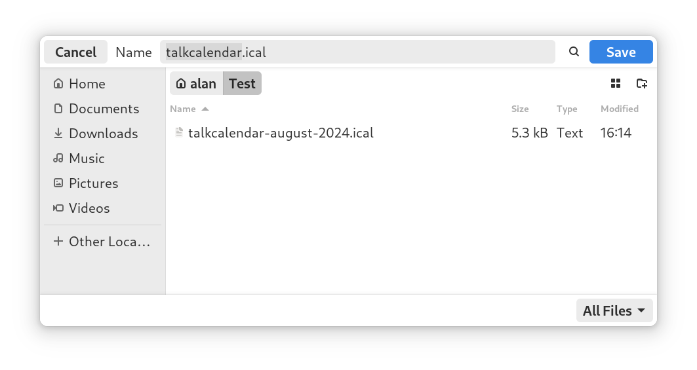
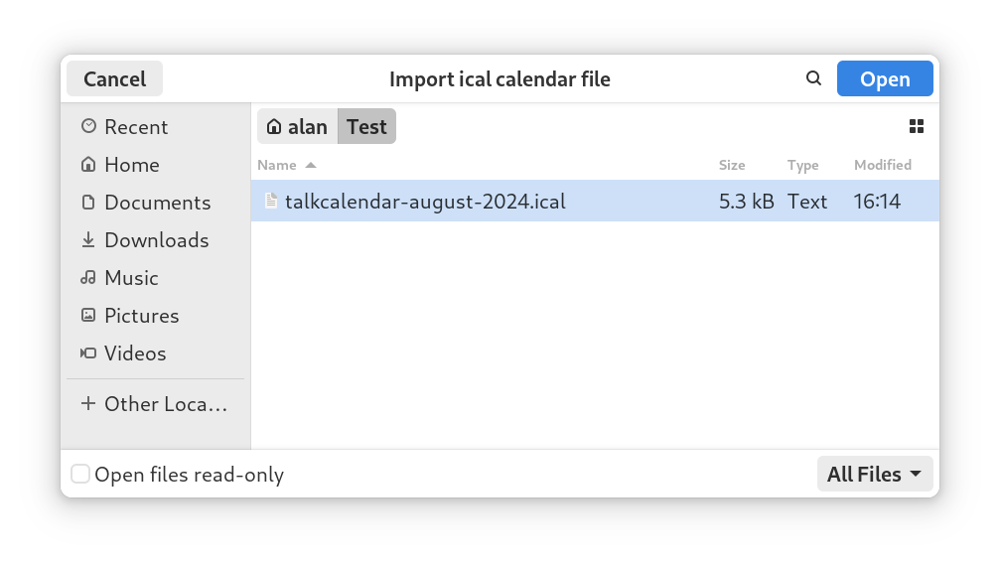

# Talk Calendar

Talk Calendar is a personal desktop calendar for Linux which has some speech capability using its own built-in text-to-speech synthesizer. It can read out current day events and upcoming events (if required) at start up.

It has been developed using C and [GTK4](https://docs.gtk.org/gtk4/). A screenshot is shown below.


## Core Features

* built with C and GTK 4.14.4 (Fedora 40)
* month view calendar 
* event details, location, start and end time can be entered and edited
* export and import iCalendar files (backup and restore)
* Sqlite3 database used to store events
* built-in diphone speech synthesizer

### Local Install Using Prebuilt Binary

A 64-bit prebuilt binary for the latest version of Talk Calendar is available and can be downloaded from the binary directory. This has been built using GTK 4.14 and tested with both Fedora 40 and Ubuntu 24.04 LTS. 

Extract the downloaded file which contains the Talk Calendar executable. Assuming that the GTK4 base libraries are installed the Talk Calendar binary can be run from the terminal using:

```
./talkcalendar
```

or double click on the "talkcalendar" file. Talk Calendar must have executable permissions to execute. Right click it and choose Properties->Permissions and tick allow "Executable as Program".

To add Talk Calendar to the system menu modify the "talkcalendar.desktop" template file provided in the download which is shown below.  Use your own user name and the  directory location for the Talk Calendar executable. The "Path" variable  defines where the Talk Calendar executable and  calendar database are located.

```
[Desktop Entry]
Version=0.1.1
Type=Application
Name=Talk Calendar
Comment=Talking calendar (espeak version)
Icon=/home/username/folder/talkcalendar/calendar.png
Exec=/home/username/folder/talkcalendar/talkcalendar
Path=/home/username/folder/talkcalendar
X-GNOME-UsesNotifications=true
Actions=
Categories=Calendar;Office;
```

Copy the "talkcalendar.desktop" file to the ***~/.local/share/applications/*** directory. Create the ~/.local/share/applications/ directory if it does not already exist. This way of locally installing Talk Calendar should be universal across different Linux distributions.

## Calendar Usage

If you have used a calendar app before then using Talk Calendar will be straight forward. 

### Adding New Event

* Click on the new event button in the header bar or press Ctrl+n to invoke the "New Event" window
* Enter the event summary (e.g. birthday)
* Enter description 
* Enter the location
* Enter the start date by setting the day, month and year values 
* Enter start and end times (or tick the all day check box)
* Events are sorted by start time when displayed
* Check the "Is Yearly" check box if the event repeats every year (e.g. birthdays)

Screenshots of the new event dialog are shown below.




### Display and Speak Events

* Select a date on the month view calendar which has events and this will invoke the day events list view as shown below.



* Event details are spoken when the day events list view is invoked (assuming that talking is selected in the preferences).

* The day events list view allows individual events to be selected so that they can be edited or deleted (make sure you click on the event before selecting either the "Edit Event" or "Delete Event button)

### Searching For Events

* Select "Event->Search from the hamburger menu .
* Enter a search term or location.





### Preferences

* Select Calendar->Preferences from the hamburger menu or use Ctrl+Alt+p to invoke the preferences window (see screenshot below).
* Change options as required.


* Use HTML colour names for changing the today and event day calendar colours.

A list of HTML colour names can be found [here](https://www.w3schools.com/tags/ref_colornames.asp). Most of the major colour names have been implemented (see the HTML colour name list). 

## Talking

* Events are spoken when a date on the month view calendar is selected (assuming talk preferences checked).

### Information

* Select "Information"  from the hamburger menu or press F1
* the information window shows the keyboard shoutcuts, how many records are in the database, the Sqlite version being used on the system, the desktop font and scale factor.


* Use the About dialog to display current version.



## Startup Applications

With GNOME based desktops you can use the GNOME "Tweak Tool" to add Talk Calendar to your startup applications. Talk Calendar will then read out the current date and days events and any future upcoming events (see preferences settings) when the computer is switched on.

### Events Database

Events are stored in an [Sqlite](https://www.sqlite.org/index.html) database. SQLite is a small, fast and full-featured SQL database engine written in C. 

### Export and Import iCalendar Files

Talk Calendar allows a personal calendar to be exported as an iCalendar file. These typically use the file extension ".ical" or ".ics". The [iCalendar standard](https://icalendar.org/) is an open standard for exchanging calendar and scheduling information between users and computers.  An icalendar file is a plain text file and so can be modified using a standard text editor. 

The export to icalendar file does not currently support time zones and so the DTSTART and DTEND properties contain dates with local time and have no reference to a time zone. For example, the following represents an event starting on January, 1st, 2024 at 11.30am and ending at 2pm.

```
DTSTART:20240101T113000
DTEND:20240101T140000
```

A file chooser dialog is used to allow the save directory location to be chosen by the user as shown below.



The icalendar import parser allows the date and local time to be imported and checks if a time zone has been specified using the [TZID](https://icalendar.org/iCalendar-RFC-5545/3-2-19-time-zone-identifier.html) property. A file chooser dialog is used to allow the file to be chosen by the user as shown below. File filters can be used.



The parser will be updated with new features in future releases.

### Recurring Events

The only recurring event type that is currently supported by Talk Calendar is yearly. This is required for events such as birthdays and anniversaries. The parser uses icalendar [RRULE](https://icalendar.org/iCalendar-RFC-5545/3-8-5-3-recurrence-rule.html) to determine if an event is yearly (e.g. birthday).

## Build From Source

The C source code for the Talk Calendar application is provided in the src directory. Fedora 40 has been used to compile the project. Fedora 40 uses GTK 4.14.

[Geany](https://www.geany.org/) can be used as a source code editor for opening, viewing and then compiling the Talk Calendar C code. Geany is lightweight and has an integrated terminal for building the application.

To build Talk Calendar from source you need the gcc compiler, GTK4, GLIB and SQLITE  development libraries. 

### Building on Fedora 40

With Fedora you need to install the following packages to compile Talk Calendar.

```
sudo dnf install gcc make
sudo dnf install gtk4-devel
sudo dnf install gtk4-devel-docs
sudo dnf install glib-devel
sudo dnf install alsa-lib-devel
sudo dnf install sqlite-devel
```

To check the installed Sqlite 3 version use the command below.

```
sqlite3 --version
```

To check the installed version of the GTK4 development libraries use the command below.

```
dnf list gtk4-devel
```

Use the MAKEFILE to compile. 

```
make
```

To run Talk Calendar from the terminal use

```
./talkcalendar
```

### Building on Ubuntu 24.04 LTS

With Ubuntu and you need to install the following packages to compile Talk Calendar.

```
sudo apt install build-essential
sudo apt install libgtk-4-dev
sudo apt install libasound2-dev
sudo apt install sqlite3
sudo apt install libsqlite3-dev
```

The packages:

```
apt install libglib2.0-dev
apt install alsa-utils
```

are needed but should be installed by default. 

You may need to use the [Ubuntu snap store](https://snapcraft.io/) to install things like Geany.

### Building on Debian 12 Bookworm

Debian 12 Bookworm uses GTK4.8 . The Talk Calendar source code has been developed using GTK4.14 (Fedora 40) and so will not compile using GTK4.8 without making a number of changes (see code notes below). Debian testing (Trixie) is the current development state of the next stable Debian distribution. According to the [Debian GTK4 tracker](https://tracker.debian.org/pkg/gtk4) Trixie currently has GTK4.12 in its repositories. Debian experimental is using GTK4.14. Talk Calendar code will most likley compile using Debian testing and experimental but I have not tried this.

To determine which version of GTK4 is running on a Debian system use the following terminal command.

```
dpkg -l | grep libgtk*
```

## Code Notes

I am now using Fedora 40 to develop the Talk Calendar application and not Debian 12 Bookworm. Fedora 40 uses GTK4.14 as opposed to the older GTK 4.8 used by Debian 12 Bookworm. This mean that the code will not compile with Debian 12 Bookworm without making changes to the source code. These include things like replacing "gtk_css_provider_load_from_string" with "gtk_css_provider_load_from_data" as the function gtk_css_provider_load_from_data was depreciated in GTK 4.12. A bigger change is that the GtkFileDialog API is no longer signal based. With GTK4.12 and above it is callback based which should match a GAsyncReadyCallback function (async/await). With Debian 12  (GTK4.8) I used the function "gtk_file_chooser_dialog_new" with a response callback but this approach has been depreciated.

## Speech Synthesis

Talk Calendar uses its own built-in diphone speech synthesizer.  Words are formed as sequences of elementary speech units. A phoneme is the smallest unit of sound that distinguishes one word from another word and there are 44 phonemes in the English language. A diphone is a sound unit composed of two adjacent partial phonemes i.e. the second half of the first phoneme and the first half of the second phoneme. The synthesizer uses a set of pre-recorded diphone sound samples and concatenates these to produce speech output for a given text input.

The voice used by Talk Calendar is based on the diphone collection created by Alan W Black and Kevin Lenzo which is free for use for any purpose (commercial or otherwise) and subject to the pretty light restrictions [detailed here](https://github.com/hypnaceae/DiphoneSynth/blob/master/diphones_license.txt). I have used the same licence for the voice that I have created. There is information about recording your own diphones [here](http://festvox.org/bsv/x2401.html) and in the speech synthesis lecture by Professor Alan W Black [here](https://www.youtube.com/watch?v=eDjtEsOvouM&t=1459s).

My diphone speech synthesizer has a number of limitations. 

1. It uses a small dictionary of approximately 56,600 English words. If a word is not recognised by the dictionary it is skipped over. 

2. Apostrophes and other special characters are not used as inserting these into the database can cause errors. There are two types of apostrophes. Apostrophes of possession and contraction. Possessive apostrophes indicate ownership of something, like in the following sentence: "Dog's birthday". You have to enter the word name without an apostrophe e.g. dogs. Contraction apostrophes are used to shorten words. For example, "It's a nice day outside" which is expanded as "It is a nice day outside". Use the expanded version with the Talk Calendar diphone speech synthesizer. 

3. The pronunciation of some words is poor as there is very little information online on how to convert words to a diphone list (in many cases I have made an educated guess). More work is needed on word pronunciation.

My diphone speech synthesizer is functional and has been coded from scratch using C and GTK4. It is more versatile than my previous speech synthesizer which was based on concatenating and playing back pre-recorded English words. I have also been working on a formant speech syntheiszer details of which can be found [here](https://github.com/crispinprojects/formant-synthesizer). 

Talk Calendar ***does not use*** the [espeak](https://github.com/espeak-ng/espeak-ng) formant speech synthesizer because the license of some of its components may not be compatible with the GTK LGPL v2.1 license. Specifically this relates to the IEEE80.c file [license](https://github.com/espeak-ng/espeak-ng/blob/c1d9341f86eee4b7a0da50712b627d8a76e92fea/src/libespeak-ng/ieee80.c) which says "Copyright (C) 1989-1991 Apple Computer, Inc." There is further discussed [here](https://opensource.stackexchange.com/questions/11545/possibilities-to-use-a-gpl-v3-licensed-library-in-a-closed-source-game). As this is a hobby project I would rather just use my own speech synthesizer coded from scratch to avoid any license compatibility issues. Obviously, my speech synthesizer although functional is not as good as espeak.

## Versioning

[SemVer](http://semver.org/) is used for versioning. The version number has the form 0.0.0 representing major, minor and bug fix changes.

## Author

* **Alan Crispin** [Github](https://github.com/crispinprojects)

## Project Status

Active and under development.

## License

GTK is released under the terms of the [GNU Lesser General Public License version 2.1](https://www.gnu.org/licenses/old-licenses/lgpl-2.1.html). Consequenty, Talk Calendar is licensed under the same LGPL v2.1 license.

## Acknowledgements

* [GTK](https://www.gtk.org/)

* GTK is a free and open-source project maintained by GNOME and an active community of contributors. GTK is released under the terms of the [GNU Lesser General Public License version 2.1](https://www.gnu.org/licenses/old-licenses/lgpl-2.1.html).

* [GTK4 API](https://docs.gtk.org/gtk4/index.html)

* [GObject API](https://docs.gtk.org/gobject/index.html)

* [Glib API](https://docs.gtk.org/glib/index.html)

* [Gio API](https://docs.gtk.org/gio/index.html)

* [Geany](https://www.geany.org/) is a lightweight source-code editor (version 2 now uses GTK3). [GPL v2 license](https://www.gnu.org/licenses/old-licenses/gpl-2.0.txt)

* [Sqlite](https://www.sqlite.org/index.html) is open source and in the [public domain](https://www.sqlite.org/copyright.html).

* [Diphone License](https://github.com/hypnaceae/DiphoneSynth/blob/master/diphones_license.txt)

* Diphone collection and synthesis Alan W. Black and Kevin Lenzo [2000](https://www.cs.cmu.edu/~awb/papers/ICSLP2000_diphone.pdf)

* [Fedora](https://fedoraproject.org/)

* [Ubuntu](https://ubuntu.com/download/desktop)

* [Debian](https://www.debian.org/)
