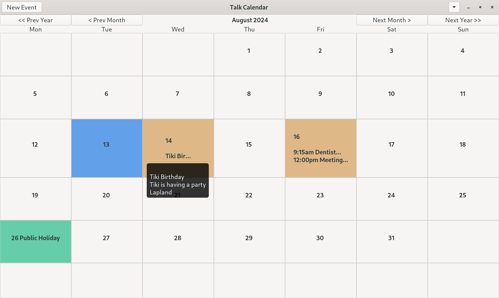
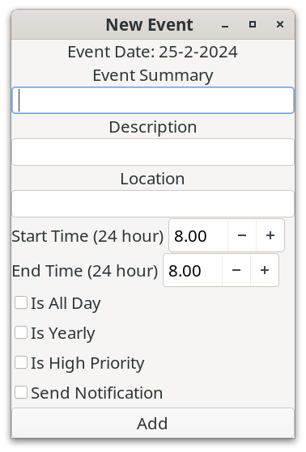
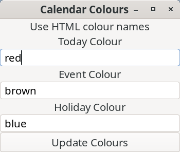
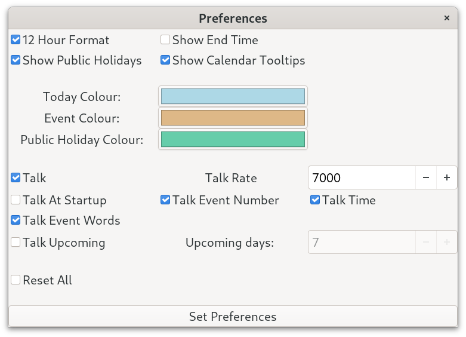
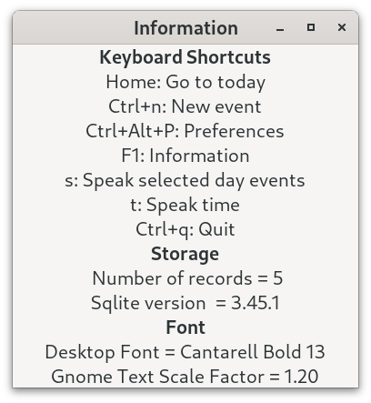

# Talk Calendar

Talk Calendar is a personal desktop calendar for Linux which has some speech capability. It has been developed using C and [GTK4](https://docs.gtk.org/gtk4/). A screenshot is shown below.



## Core Features

* built with C and GTK 4.8.3 (Debian 12)
* bespoke custom calendar which allows dates with events to be marked (colour and audio)
* event type, details, location, start and end time can be entered and edited
* priority, is-yearly and notifications can be used
* speech date reader, time reader, event type reader
* Sqlite3 database used to store events

## Installing

### BASH Installer

The easiest way to install Talk Calendar on GTK4 based distributions (e.g. the latest Debian, Ubuntu and Solus distros) is to use the bash script installer from the terminal. This can be downloaded from the bash installer directory.

Extract the downloaded file, open a terminal, then run the command below and follow the on-screen instructions.

```
./install-talkcalendar.sh
```

The installer assumes that you are a member of the sudo group and that the GTK4, SQLITE and the ALSA base libraries are installed which is the default for most modern GTK based distros.

To uninstall Talk Calendar use the command.

```
./uninstall-talkcalendar.sh
```
The BASH script installer places the Talk Calendar binary and calendar icon in the following location.

```
/usr/bin/talkcalendar
```
The bash script installer has been tested using Debian 12 Bookworm (GNOME, Budgie and Xfce desktops), Solus 4.5 (Budgie), Ubuntu GNOME 22.04 and Ubuntu GNOME 23.10. See the "Installer Trouble Shooting" notes at the bottom of the page for more information if you have any issues using it. For example, with a Debian 12 (root password) standard install you may not be a member of the sudo group and the notes explain how to simply fix this.

### Local Install Using Prebuilt Binary

A 64-bit prebuilt binary for the latest version of Talk Calendar is available and can be downloaded from the binary directory. 
Extract the downloaded file which contains the Talk Calendar executable. Assuming that the GTK4 base libraries are installed the Talk Calendar binary can be run from the terminal using:

```
./talkcalendar
```
or double click on the "talkcalendar" file. Talk Calendar must have executable permissions to execute. Right click it and choose Properties->Permissions and tick allow "Executable as Program".

To add Talk Calendar to the system menu modify the "talkcalendar.desktop" file provided in the download using your user name and application location and copy it to the ***.local/share/applications/*** directory.

This way of installing Talk Calendar should be universal across distros and has been tested using Debian 12 Bookworm (GNOME, Budgie and Xfce desktops), Solus 4.5 (Budgie), Ubuntu 22.04, Ubuntu 23.10 and Fedora.

## Calendar Usage

If you have used a calendar app before then using Talk Calendar will be straight forward. 

### Adding New Event

* Select event date using the calendar
* Select "Event->New Event" from the menu or press Ctrl+n to invoke the "New Event" window
* Select the event type using the drop down (e.g. meeting, birthday, anniversary, doctor, dentist etc.)
* Enter the event details
* Enter the location (optional)
* Enter start and end times (or all day)
* Events are sorted by start time when displayed
* Navigate through the year using the calendar to add events



When a creating a new event you can check "Send Notification" which will send a system notification when Talk Calendar is started on the day in which the event occurs.

### Editing Existing Event

* Select the event in the list view and either select "Event->Edit Selected Event" from the menu or press Ctrl+e
* Change details as appropriate

### Changing Calendar Colours

* Select the calendar colour window using Calendar->Colours from the menu
* Enter the HTML colour name for changing the today, event and holiday calendar colour marks



A list of HTML colour names can be found [here](https://www.w3schools.com/tags/ref_colornames.asp). Most of the major colour names have been implemented (see attached colour name list) which should be sufficient if using either a light or dark legacy desktop colour theme.

### Preferences

* Select Calendar->Preferences from the menu or use Ctrl+Alt+p to invoke the preferences window (see screenshot below)
* Change options as required



You can use 12 hour format. Event end-times can also be shown in the list view. If notable dates is selected then the date label shows special calendar dates such as some UK public holidays and BST etc. These are also spoken.

Talk options can be changed.


## Talking

* Press spacebar to speak event details.

### Information

* Select "Help->Information from the menu or press F1
* the information window shows the keyboard shoutcuts, how many records are in the database, the Sqlite version being used on the system, the desktop font and scale factor.



* Use the About dialog to display current version.

### Keyboard Shortcuts

```
Ctrl+n			New Event
Ctrl+e			Edit Selected Event
Delete			Delete Selected Event
Ctrl_Alt+p		Preferences window
Spacebar		Speak
t			Speak Time
F1			Information
```

## Startup Applications

Add Talk Calendar to your start-up programs to read out the date and any event details when the computer is switched on.

With GNOME based desktops use the GNOME "Tweak Tool" to add Talk Calendar to your startup applications if required.

## How is Speech Generated?

Talk Calendar incorporates a small word-based speech synthesizer used to concatenate and play-back pre-recorded English words using the computer speaker. The voice used by this version of Talk Calendar is based on my own recordings and so is subject to same license as the project. The voice will be improved and updated in future versions of the project.

### Events Database

Events are stored in an [Sqlite](https://www.sqlite.org/index.html) database. SQLite is a small, fast and full-featured SQL database engine written in C. 

### Backup Restore Events Database

A first attempt of a backup and restore system has been implemented in case the Sqlite events database becomes corrupted (e.g. by using another external program to open it or by attempting to vacuum it). You should backup your events by using the export to CSV file menu item which will create an "events.csv" file in the working directory (keep this safe and make another copy if necessary). If you then corrupt your database, you can clear all events from the Sqlite database and then use the import from  CSV restore option which assumes that the "events.csv" file is in the current working directory. If you completely corrupt your Sqlite database called calendar.db then rename it and restart Talk Calendar which will create a new empty database and restore into this. 

I have not tested what will happen if you attempt to vacuum your database externally and then restart Talk Calendar with this.

## Build From Source

The C source code for the Talk Calendar application is provided in the src directory.

[Geany](https://www.geany.org/) can be used as a source code editor for opening, viewing and then compiling the Talk Calendar C code. Geany is lightweight and has an integrated terminal for building the application.

You need the GTK4 development libraries and the gcc compiler. The code has been compiled using GTK 4.8.3 amd64 (Debian 12). To determine which version of GTK4 is running on a Linux system use the following terminal command.

```
dpkg -l | grep libgtk*
```

To build Talk Calendar you also need the Sqlite3 development libraries. With Debian and Ubuntu you install these using the commands below.

```
sudo apt install sqlite3
sudo apt install libsqlite3-dev
```

To check the installed version use the command below.

```
sqlite3 --version
```

### Building on Ubuntu and Debian Bookworm

With both  Debian Bookworm and Ubuntu and you need to install the following packages to compile Talk Calendar.

```
apt install build-essential
apt install libgtk-4-dev
apt install libasound2-dev
```

The packages:

```
apt install libglib2.0-dev
apt install alsa-utils
```

are needed but should be installed by default.

With Ubuntu 22.04 the base GTK4 libraries are installed by default. With other Ubuntu based distributions (spins) you may have to install these using the command below.

```
sudo apt install libgtk-4-1
```

Use the MAKEFILE to compile. 

```
make
```

To run Talk Calendar from the terminal use

```
./talkcalendar
```

### Building on Fedora

With Fedora you need to install the following packages to compile Talk Calendar.

```
sudo dnf install gtk4-devel
sudo dnf install gtk4-devel-docs
sudo dnf install glib-devel
sudo dnf install alsa-lib-devel
```

### Building on Solus Linux

To build Talk Calendar on Solus Linux (tested with Solus 4.5 Budgie) you need to install the development packages below. Solus is an independent Linux distribution not based on either Debian or Fedora and has its own package manager called "eopkg".

```
sudo eopkg install -c system.devel
sudo eopkg install libgtk-4-devel
sudo eopkg install sqlite3-devel
sudo eopkg install libnotify-devel
sudo eopkg install alsa-lib-devel
```

To install development tools on Solus linux including gcc you need to [install the system.devel package](https://techviewleo.com/install-development-tools-on-solus-linux/). You also have to install the GTK4, SQLite3, libnotify and the ALSA development libraries. Use the Makefile to build Talk Calendar as shown below.

```
make
```
To run Talk Calendar use the following.

```
./talkcalendar
```

### Notifications

Startup day event notifications have now been implemented using [libnotify](https://gitlab.gnome.org/GNOME/libnotify). This library is an implementation of the [Desktop Notifications Specification](https://specifications.freedesktop.org/notification-spec/notification-spec-latest.html) which provides support for GTK and Qt applications and is ***desktop independent***. 

I have developed a small GTK4 notification tester app which can be found [here](https://github.com/crispinprojects/notification-tester) with screenshots and notes for Debian GNOME (Wayland) and Debian Budgie (X11) testing. I found that GNotification code works on Debian Budgie (X11) but not on Debian GNOME (Wayland). Consequently, I am currently using libnotify for implementing notifications in Talk Calendar.

## Versioning

[SemVer](http://semver.org/) is used for versioning. The version number has the form 0.0.0 representing major, minor and bug fix changes.

## Author

* **Alan Crispin** [Github](https://github.com/crispinprojects)

## License

Talk Calendar is licensed under LGPL v2.1. GTK is released under the terms of the LGPL v2.1 license.

## Project Status

Active.


## BASH Installer Troubleshooting (Debian)

In most cases the BASH script installer will just run as the required libraries will be installed by default and the user will be a member of the sudo group. The installer must have executable permissions. To make the installer script executable use the command below.

```
chmod +x install-talkcalendar.sh 

```
See notes below for other issues. 

#### Not a member of the sudo group

The BASH installer assumes that you are a member of the sudo group. If you have installed Debian 12 with a root password then you will have to add yourself to the sudo group. The commands below show how to do this.

```
su -
adduser your-user-name sudo
```

Then restart.

#### No GTK4 libraries

The BASH installer assumes that the GTK4 libraries are installed. These are installed by default on Debian GNOME and Ubuntu but sometimes are not installed on some spins or if creating a desktop from a Debian base install. To install them use the command below.

```
sudo apt install libgtk-4-1
```

If you intend to build from source then you need the following development libraries.

```
sudo apt install build-essential
sudo apt install libgtk-4-dev
sudo apt install libglib2.0-dev
sudo apt install libasound2-dev
```

#### No ALSA library

The BASH installer assumes that the Advanced Linux Sound Architecture (ALSA) library is installed. This provides audio and MIDI functionality to the Linux operating system and is installed by default in Debian and Ubuntu distros. However if building a desktop from a Debian base install you will need to install ALSA as shown below.

```
sudo apt install alsa-utils
```

#### No SQLite libraries

The BASH installer assumes that the SQLite library is installed as an Sqlite3 database is used for storing events. This is installed by default on most Linux distros. With Debian (Ubuntu) based distributions you can check the version of Sqlite installed on your system using the terminal command below.

```
apt policy sqlite3
```

If sqlite3 is not installed then use the following command.

```
sudo apt install sqlite3
```

If compiling from source you will need to install the development library.

```
sudo apt install libsqlite3-dev
```

#### Check installed packages

To check what packages are installed on your system use the command below.

```
apt list --installed | more
```


## Acknowledgements

* [GTK](https://www.gtk.org/)

* GTK is a free and open-source project maintained by GNOME and an active community of contributors. GTK is released under the terms of the [GNU Lesser General Public License version 2.1](https://www.gnu.org/licenses/old-licenses/lgpl-2.1.html).

* [GTK4 API](https://docs.gtk.org/gtk4/index.html)

* [GObject API](https://docs.gtk.org/gobject/index.html)

* [Glib API](https://docs.gtk.org/glib/index.html)

* [Gio API](https://docs.gtk.org/gio/index.html)

* [Geany](https://www.geany.org/) is a lightweight source-code editor (version 2 now uses GTK3). [GPL v2 license](https://www.gnu.org/licenses/old-licenses/gpl-2.0.txt)

* [Sqlite](https://www.sqlite.org/index.html) is open source and in the [public domain](https://www.sqlite.org/copyright.html).

* How to Install Budgie Desktop on Debian. See [here](https://www.linuxcapable.com/how-to-install-budgie-desktop-on-debian-linux/) and [here](https://packages.debian.org/bookworm/budgie-desktop).

* [Debian](https://www.debian.org/)

* [Fedora](https://fedoraproject.org/)
