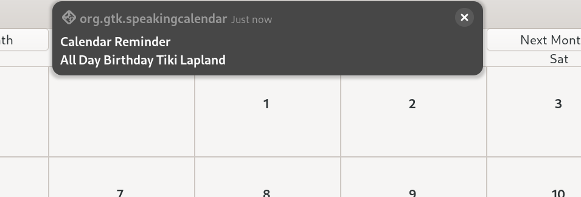

# Speaking Calendar

Speaking Calendar is a personal desktop calendar for Linux which has some speech capability using its own built-in speech engine for speaking dates, times and event words.

The Linux Speaking Calendar has been developed using C and [GTK4](https://docs.gtk.org/gtk4/). A screenshot is shown below.


## Core Features (Linux Speaking Calendar)

* built with C and GTK 4.14.4 (Fedora 40)
* month-view calendar 
* event details, location, start and end time can be entered and edited
* export and import iCalendar files (backup and restore)
* event time reminder alarms (sent as system notifications and audio alerts)
* Sqlite3 database used to store events
* built-in word concatenation speech synthesizer (date, time and event word reader)

### Local Install Using Prebuilt Binary

A 64-bit prebuilt binary for the latest version of Speaking Calendar is available and can be downloaded from the binary directory. This has been built using GTK 4.14 and tested with Fedora 40 and Ubuntu 24.04 LTS. 

Extract the downloaded file which contains the Speaking Calendar executable. Assuming that the GTK4 base libraries are installed the Speaking Calendar binary can be run from the terminal using:

```
./speakingcalendar
```

or double click on the "speakingcalendar" file. Speaking Calendar must have executable permissions to execute. If it does not then right click on the Speaking Calendar binary file and choose Properties->Permissions and tick allow "Executable as Program".

To add the Linux Speaking Calendar to the system menu modify the Speaking Calendar desktop file provided in the download. A desktop file has a .desktop extension and provides metadata about an application such as its name, icon, command to execute and other properties. For user-specific applications desktop files can be located locally in the ~/.local/share/applications/ directory. Local user entries take precedence over system entries. For the GNOME desktop, the desktop file should be named using the [application ID](https://developer.gnome.org/documentation/tutorials/application-id.html), that is <application_id>.desktop, which in this case is "org.gtk.speakingcalendar.desktop" 

The "org.gtk.speakingcalendar.desktop" file is shown below. You need to modify this using your own user name and directory locations. For example, if your user name is "tiki" and you install local applications in a folder called "Software" and you create a folder called "speakingcalendar " to store the Speaking Calendar binary executable then the executable path would be "Exec=/home/tiki/Software/speakingcalendar/speakingcalendar". The Exec variable defines the command to execute when launching an application, in this case, the speakingcalendar binary executable. The Path variable tells the system where to look for the executable and the calendar database. The Icon variable specifies the path to the icon file associated with the application. In a .desktop file, you need to use absolute and full paths.

```
[Desktop Entry]
Version=0.1.0
Type=Application
Name=Speaking Calendar
Comment=Linux Speaking Calendar
Icon=/home/your-user-name/folder/speakingcalendar/calendar.png
Exec=/home/your-user-name/folder/speakingcalendar/speakingcalendar
Path=/home/your-user-name/folder/speakingcalendar
X-GNOME-UsesNotifications=true
Categories=Calendar;Office;
MimeType=text/calendar;
```

Copy your modified  "org.gtk.speakingcalendar.desktop" file to the ***~/.local/share/applications/***  hiden directory (tick the "Show Hidden Files" option in the file explorer). Create the ~/.local/share/applications/ directory if it does not already exist. This way of locally installing Speaking Calendar should be universal across different Linux distributions.

## Calendar Usage

If you have used a calendar application before then using Speaking Calendar will be straight forward. 

### Adding New Event

* Click on the "New Event" button in the header bar or press Ctrl+n to invoke the "New Event" window
* Select the event speech word (summary) using the dropdown
* Enter the event description 
* Enter the location
* Enter the start date by setting the day, month and year values 
* Enter start and end times (or tick the all day check box)
* Times are entered as hour and minute values using the 24-hour time notation
* Events are sorted by start time when displayed
* Check the "Is Yearly" check box if the event repeats every year (e.g. birthdays and anniversaries)

A screenshot of the new event dialog is shown below.


### Reminders

Speaking Calendar supports the use of reminders. A reminders is an alarm triggered at a specified time before an event starts.

* Check the "Reminder" check box and set the reminder time (hour, minute) which should be a time before the event starts.

When a reminder is triggered a notification is sent to the system and an audio message played



### Display and Speak Events

* Click on a date in the month-view calendar which has events and this will invoke the day events list view as shown below.


* The date and any event details are read out when the day events list view is invoked assuming that speaking is selected in the preferences.

* The day events list view allows individual events to be selected so that they can be edited or deleted (make sure you click on the event before using either the "Edit Event" or "Delete Event" button).

### Tooltips

A tooltip is a text bubble that displays event details when the mouse hovers over a day in the month-view calendar. I introduced tooltips because they can be a good accessibility feature. However, with some forms of visual impairment tooltips on hover can be problematic. Consequently, I have added an option in the preferences dialog to turn them off.

### Searching For Events

* Select "Search For Events" from the hamburger menu .
* Enter a search term or location.


### Preferences

* Select "Preferences" from the hamburger menu or use Ctrl+Alt+p to invoke the preferences window (see screenshot below).
* Change options as required.


* Check "Show Public Holidays" to display the main UK public holidays on the Calendar.
* Click on the colour buttons to change the today, event-day and public holiday calendar background colours to aid readability.


## Speaking

* Speaking the selected day events is done by pressing the "s" key or using the menu item "Speak Selected Day".
* Selecting a day in the month-view calendar will read out the date and any event details (e.g. time and event words) assuming that speaking is selected in the preferences.
* The Linux Speaking Calendar will tell you the time if you press the "t" key (i.e. a speaking clock).
* Change the "Speech Rate" value in the Preferences dialog to speed up speaking (if required).

### Information

* Select "Information"  from the hamburger menu or press F1
* the information window shows the keyboard shoutcuts, how many records are in the database, the Sqlite version being used on the system, the desktop font and scale factor.


* Use the About dialog to display current version.


## Startup Applications

With GNOME based desktops you can use the GNOME "Tweak Tool" to add Speaking Calendar to your startup applications. Speaking Calendar can then read out the current date, details of day events and any future upcoming events (see preferences settings) when the computer is switched on.

### Events Database

Events are stored in an [Sqlite](https://www.sqlite.org/index.html) database. SQLite is a small, fast and full-featured SQL database engine written in C. 

### Export and Import iCalendar Files

Speaking Calendar allows a personal calendar to be exported as an iCalendar file. These typically use the file extension ".ical" or ".ics". The [iCalendar standard](https://icalendar.org/) is an open standard for exchanging calendar and scheduling information between users and computers.  An icalendar file is a plain text file and so can be modified using a standard text editor. 

The export to icalendar file does not currently support time zones and so the DTSTART and DTEND properties contain dates with local time and have no reference to a time zone. For example, the following represents an event starting on 14th August 2024 at 11.30am and ending at 2pm.

```
DTSTART:20240814T113000
DTEND:20240814T140000
```

A file chooser dialog is used to allow the save directory location to be chosen by the user as shown below.


The icalendar import parser allows the date and local time to be imported and checks if a time zone has been specified using the [TZID](https://icalendar.org/iCalendar-RFC-5545/3-2-19-time-zone-identifier.html) property. A file chooser dialog is used to allow the file to be chosen by the user as shown below. File filters can be used.


The parser will be updated with new features in future releases.

### Recurring Events

The only recurring event type that is currently supported by Speaking Calendar is yearly. This is required for events such as birthdays and anniversaries. The parser uses icalendar [RRULE](https://icalendar.org/iCalendar-RFC-5545/3-8-5-3-recurrence-rule.html) to determine if an event is yearly (e.g. birthday).

### Upgrading To Newer version

It is strongly suggested that you save your current calendar in "ical" format before updating to a newer version of the Linux Speaking Calendar. Calendar "ical" files can be edited using a standard text editor. To upgrade install Speaking Calendar with a new "calendar.db" database and import the saved  ical file to this.

For a clean install also delete the speaking-calendar config folder and file located at ~/.config/speaking-calendar.

## Build From Source

The C source code for the Speaking Calendar application is provided in the src directory. Fedora 40 has been used to develop and compile the project. Fedora 40 uses GTK 4.14.

[Geany](https://www.geany.org/) can be used as a source code editor for opening, viewing and then compiling the Speaking Calendar C code. Geany is lightweight and has an integrated terminal for building the application.

To build Speaking Calendar from source you need the gcc compiler, GTK4, GLIB and SQLITE  development libraries. 

### Building on Fedora 40

With Fedora you need to install the following packages to compile Speaking Calendar.

```
sudo dnf install gcc make
sudo dnf install gtk4-devel
sudo dnf install gtk4-devel-docs
sudo dnf install glib-devel
sudo dnf install alsa-lib-devel
sudo dnf install sqlite-devel
sudo dnf install libnotify-devel
```

To check the installed Sqlite 3 version use the command below.

```
sqlite3 --version
```

To check the installed version of the GTK4 development libraries use the command below.

```
dnf list gtk4-devel
```

Use the MAKEFILE to compile. 

```
make
```

To run Speaking Calendar from the terminal use

```
./speakingcalendar
```

### Building on Ubuntu 24.04 LTS

With Ubuntu and you need to install the following packages to compile Speaking Calendar.

```
sudo apt install build-essential
sudo apt install libgtk-4-dev
sudo apt install libasound2-dev
sudo apt install sqlite3
sudo apt install libsqlite3-dev
sudo apt install libnotify-dev
```

The packages:

```
apt install libglib2.0-dev
apt install alsa-utils
```

are needed but should be installed by default. 

You may need to use the [Ubuntu snap store](https://snapcraft.io/) to install things like Geany.

### Building on Debian 12 Bookworm

Debian 12 Bookworm uses GTK4.8. The Speaking Calendar source code has been developed using GTK4.14 (Fedora 40) and so it will not compile using GTK4.8 without making a number of changes (see code notes below). Debian testing (Trixie) is the current development state of the next stable Debian distribution. According to the [Debian GTK4 tracker](https://tracker.debian.org/pkg/gtk4) Trixie currently has GTK4.12 in its repositories. Debian experimental is using GTK4.14. Speaking Calendar code will most likely compile using Debian testing and experimental but I have not tried this.

To determine which version of GTK4 is running on a Debian system use the following terminal command.

```
dpkg -l | grep libgtk*
```

## Code Notes

I am now using Fedora 40 to develop the Speaking Calendar application and not Debian 12 Bookworm. Fedora 40 uses GTK4.14 as opposed to the older GTK 4.8 used by Debian 12 Bookworm. This mean that the code will not compile with Debian 12 Bookworm without making changes to the source code. For example, Speaking Calendar now uses "gtk_css_provider_load_from_string" rather than "gtk_css_provider_load_from_data" which was depreciated in GTK 4.12.

A bigger change is that the GtkFileDialog API is no longer signal based. With GTK4.12 and above it is callback based which should match a GAsyncReadyCallback function (async/await pattern). In computer programming, the async/await pattern is a syntactic feature that allows an asynchronous, non-blocking function to be structured in a way similar to an ordinary synchronous function. With my Debian 12 (GTK4.8) projects I used the older function "gtk_file_chooser_dialog_new" with a response callback but this approach has been depreciated.

Code related to colours has been migrated to use GdkRGBA as GdkColor is being deprecated. The code for setting HTML CSS colour names has been completely removed in favour of the new GtkColorDialog API. A [GtkColorDialogButton](https://docs.gtk.org/gtk4/class.ColorDialogButton.html) is wrapped around a GtkColorDialog allowing a colour chooser dialog to be opened to change calendar colours.

Playing audio using GThread and GMutex has been replaced with GTask (async/wait pattern). With GTK4 it appears that the preferred way to perform work in a thread is to use GTask. The code now uses [g_task_run_in_thread()](https://docs.gtk.org/gio/method.Task.run_in_thread.html) so that a play audio blocking operation is executed in a separate background thread. The function g_task_run_in_thread() turns a synchronous operation into an asynchronous one, by running it in a thread. Apparently, GTask maintains a thread pool that is based on the number of CPUs available (i.e. supports multiple CPU-cores). The basic GTask code structure is now working but will be updated as I learn more. I have now added a guard to prevent multiple audio clips being played at once.

The Calendar itself has received a number of updates including using tooltips to show event details when you hover over a day in the month-view display.

## Speech Synthesis

Speaking Calendar incorporates a small word-based speech synthesizer used to concatenate and play-back pre-recorded English words using the computer speaker. The voice used by this version of Speaking Calendar is based on my own recordings and so is subject to same license as the project. Words are recorded in a headless RAW audio format so that they can be converted to hexadecimal values and stored in an array and added to a voice header file. The voice will be improved and updated in future versions of the project.

Many open source and commercial speech synthesizers use the formant speech synthesis approach. For example, the excellent [eSpeak](https://espeak.sourceforge.net/) open source speech synthesizer for Linux and Windows uses a formant synthesis method. I had considered using eSpeak rather than code my own speech synthesizer but I discovered that some of its components may not be compatible with the GTK LGPL v2.1 license. For example, the IEEE80.c file [license](https://github.com/espeak-ng/espeak-ng/blob/c1d9341f86eee4b7a0da50712b627d8a76e92fea/src/libespeak-ng/ieee80.c) says "Copyright (C) 1989-1991 Apple Computer, Inc." which is very strange given that espeak has a GPL v3 [license](https://espeak.sourceforge.net/license.html). This is discussed further in the forum post [here](https://opensource.stackexchange.com/questions/11545/possibilities-to-use-a-gpl-v3-licensed-library-in-a-closed-source-game). 

Consequently, as Speaking Calendar is a hobby project I would rather just use my own small word-based speech synthesizer  to avoid any potential license compatibility issues with using eSpeak. 

I have also been working on a formant speech synthesizer the details of which can be found [here](https://github.com/crispinprojects/formant-synthesizer) but the sound quality is very robotic with buzzing and humming background noise.

### History

The original project was named Talk Calendar but feedback suggested that the project would have some sort of voice control which is not the case.  The name "Speaking Calendar" better conveys the purpose of the application. Also early versions of this project required that the eSpeak speech synthesizer be installed separately so that commands could be send to it to handle speech output.  However, I dropped this approach in favour of my own integral speech engine. I also discovered a potential eSpeak license compatibilty issue discussed above.

## Versioning

[SemVer](http://semver.org/) is used for versioning. The version number has the form 0.0.0 representing major, minor and bug fix changes.

Speaking Calendar was renamed from my previous project called Talk Calendar in August 2024 and the version number was reset to 0.1.0.

## Author

* **Alan Crispin** [Github](https://github.com/crispinprojects)

## Project Status

Active and under development.

## License

GTK is released under the terms of the [GNU Lesser General Public License version 2.1](https://www.gnu.org/licenses/old-licenses/lgpl-2.1.html). Consequenty, The Linux Speaking Calendar is licensed under the same LGPL v2.1 license.

## Acknowledgements

* [GTK](https://www.gtk.org/)

* GTK is a free and open-source project maintained by GNOME and an active community of contributors. GTK is released under the terms of the [GNU Lesser General Public License version 2.1](https://www.gnu.org/licenses/old-licenses/lgpl-2.1.html).

* [GTK4 API](https://docs.gtk.org/gtk4/index.html)

* [GObject API](https://docs.gtk.org/gobject/index.html)

* [Glib API](https://docs.gtk.org/glib/index.html)

* [Gio API](https://docs.gtk.org/gio/index.html)

* [Geany](https://www.geany.org/) is a lightweight source-code editor (version 2 now uses GTK3). [GPL v2 license](https://www.gnu.org/licenses/old-licenses/gpl-2.0.txt)

* [Sqlite](https://www.sqlite.org/index.html) is open source and in the [public domain](https://www.sqlite.org/copyright.html).

* [Fedora](https://fedoraproject.org/)

* [Ubuntu](https://ubuntu.com/download/desktop)

* [Debian](https://www.debian.org/)

* [Formant speech synthesizer](https://github.com/crispinprojects/formant-synthesizer) 
